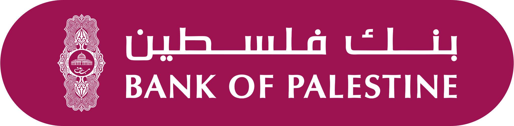

    <h1>Ahmad Nasriya</h1>
    

        <b>Independent Developer, Infrastructure Architect, and OSS  Maintainer</b> 
        Building local-first software with minimal dependencies andmaximal   autonomy.
    

---

## 🛠️ About Me

I'm a backend engineer and infrastructure architect focused on building fast, secure, and self-reliant systems. I create tools that eliminate unnecessary third-party dependencies and prioritize local control, performance, and privacy. Most of my production-ready work is published under the [@nasriyasoftware](https://github.com/nasriyasoftware) GitHub organization and on [📦 npm](https://npmjs.com/~ahmadnasriya).

---

## 🧭 Philosophy
> [!IMPORTANT]
>
> **Minimal dependencies — by principle, not convenience**  
> I avoid third-party dependencies wherever possible to build software that is self-contained, fully inspectable, and resilient.  
> This isn’t just about technical control — it’s a commitment to autonomy, sustainability, and ethical independence.
>
> **In-house over outsourced**  
> Wherever possible, I develop core tools — such as file watchers, caching systems, and schedulers — from scratch.  
> This reduces reliance on corporate-controlled ecosystems and ensures full ownership over function, performance, and future.
>
> **Boycott as a software practice**  
> I deliberately avoid technologies and services maintained by corporations complicit in funding or enabling the occupation and ongoing violence against Palestinian people.  
> This is a moral and political choice — embedded in every line of infrastructure I write.
>
> **No black boxes**  
> Dependencies, if ever used, must be transparent, traceable, and minimal — dev-only or peer-only when possible.  
> The goal is clarity and accountability, not convenience.
>
> **Opt-in only behavior**  
> All side effects — from file system events to network operations — are strictly opt-in, giving full control to the developer using the tools.

---

### 🕊️ Support Software Independence

I’m a Palestinian developer building zero-dependency tools and open infrastructure to reduce reliance on platforms that exclude people like me.

<!-- Optional: Add Bank of Palestine support -->
<!-- 
 -->

 
 

> [!CAUTION]
> 💸 I can receive payments — but **can’t access the funds from Palestine**.  
> If you know a workaround or want to collaborate on infrastructure solutions, [DM me on LinkedIn](https://www.linkedin.com/in/ahmadnasriya/).

Every **star**, **share**, and **contribution** moves us closer to a freer, more inclusive internet.

---

## 📦 Notable Packages

| Package | What It Does | Domain | Downloads |
|---------|--------------|--------|-----------|
| [`@nasriya/hypercloud`](https://npmjs.com/package/@nasriya/hypercloud) | Lightweight HTTP2 framework with static caching | 🌐 Networking |  |
| [`@nasriya/orchestriq`](https://npmjs.com/package/@nasriya/orchestriq) | Powerful CI/CD orchestration and automation toolkit | 🔄 CI/CD |  |
| [`@nasriya/authcrypto`](https://npmjs.com/package/@nasriya/authcrypto) | JWT, password hashing, encryption toolkit | 🔐 Security |  |
| [`@nasriya/mongodb`](https://npmjs.com/package/@nasriya/mongodb) | Advanced MongoDB client with caching + broker sync | 🗄️ Databases |  |
| [`@nasriya/uuidx`](https://npmjs.com/package/@nasriya/uuidx) | Tiny UUID generator | 🆔 Identifiers |  |
| [`@nasriya/recaptcha`](https://npmjs.com/package/@nasriya/recaptcha) | Server-side reCAPTCHA validation | 🧠 Bot Protection |  |
| [`@nasriya/logify`](https://npmjs.com/package/@nasriya/logify) | Structured Node.js logger | 🧾 Logging |  |
| [`@nasriya/cron`](https://npmjs.com/package/@nasriya/cron) | Clean cron scheduler | ⏱ Scheduling |  |
| [`@nasriya/dns`](https://npmjs.com/package/@nasriya/dns) | DNS & domain management | 🌍 Infrastructure |  |
| [`@nasriya/postbuild`](https://npmjs.com/package/@nasriya/postbuild) | Build-time task runner | ⚙️ Tooling |  |

➡️ See more on my [npm profile](https://www.npmjs.com/~ahmadnasriya)

> [!NOTE]
> 📦 All packages are cleanly typed, well-tested, and built with minimal dependencies—many with **zero runtime dependencies** where feasible.

---

## 🚧 In Progress — Roadmap

### 1. 🕵️ **Overwatch**
A platform-agnostic file system change detector  
> [!TIP]
> Reliable and configurable file system change detection
> Overwatch provides consistent, platform-independent monitoring of file system changes without relying on native OS watchers or external dependencies. Its configurable detection frequency lets you balance responsiveness and resource usage for your specific environment.

### 2. ⚡ **HyperCache**
Intelligent, real-time caching engine
> [!TIP]
> - Caches values and static files  
> - Reacts to file changes instantly using Overwatch  
> - Integrated into [`@nasriya/hypercloud`](https://npmjs.com/package/@nasriya/hypercloud) for static route caching  
> - Can be used independently in any server or CLI context

### 3. 🧠 [`@nasriya/mongodb`](https://npmjs.com/package/@nasriya/mongodb) (Next Phase)  
Multi-adapter, failover-safe MongoDB client  
> [!TIP]
> - Uses [HyperCache] for smart internal cache  
> - Connects to a **data broker** via WebSockets  
> - Syncs cache across DB instances when writes occur  
> - Flushes cache on disconnect and rehydrates when reconnected  
> - Future: support for **multi-database writes** and **read fallback**

### 4. 🗂 **FileVerse**  
Media-optimized file server for apps
> [!TIP]
> - Serves from cloud storage, NFS, or SMB  
> - Enforces authentication, authorization, and rate-limits  
> - Designed to integrate seamlessly into a microservice stack  
> - Can be used as a standalone file server with [Overwatch] + [HyperCache]

---

## 💼 Work With Me

I occasionally take on freelance or contract work — especially when the project reflects my core principles: ethical software, full transparency, and developer-first tooling that resists corporate lock-in.

### 🛠 What I Do
- 🧠 **Systems programming in Node.js (TypeScript)**  
  I build everything from file watchers, schedulers, and CI/CD pipelines to media servers and cloud-free infrastructure — zero dependencies where possible, total control always.

- 📦 **Custom SDKs, libraries & adapters**  
  I create well-documented, production-ready Node.js packages tailored to your API, service, or workflow. Minimal dependencies, maximum clarity.

- 🏗️ **Service architecture & backend infrastructure**  
  Need a centralized OAuth provider? A secure media gateway? A distributed caching layer? I build independent services that work with — or without — your existing stack.

- 🧭 **Consulting & architectural guidance**  
  Whether you’re starting from scratch or scaling a legacy system, I offer expert insights on architecture, maintainability, and long-term system health.

- 🌐 **Full-stack, when necessary**  
  I can work across the stack when needed — but I don’t do modern frontend frameworks and I won’t work on **React** projects, under any circumstances.

> [!NOTE]
> I do not take React-based projects.

---
## 🤝 Collaborate With Me

Whether you're looking for a conversation, consultation, or a full project — I’m open to meaningful work that aligns with my values.

---
## 🧪 Explore

---

<h3 style="text-align:center">Built from scratch. Designed for clarity. Made with ❤️ in Palestine 🇵🇸</h3>